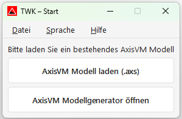
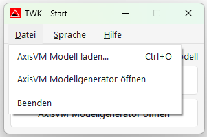

# Startfenster

Beim Starten der TWK-App erscheint das Startfenster. Von hier aus kann ein bestehendes AxisVM-Modell geladen oder der AxisVM Modellgenerator geöffnet werden.

---

## Zwei mögliche Startwege

- **Neues Modell erstellen:** Über **„AxisVM Modellgenerator öffnen"** wird zuerst ein neues Schutzraum-Modell erstellt und daraus anschliessend ein AxisVM-Modell generiert.
- **Bestehendes Modell verwenden:** Wenn bereits ein AxisVM-Modell (`.axs`) vorhanden ist, kann es direkt über **„AxisVM Modell laden (.axs)"** in die TWK-App geladen werden.

---

## Modell laden

1. Auf **„AxisVM Modell laden (.axs)"** klicken.
2. Im Datei-Dialog die gewünschte `.axs`-Datei auswählen.
3. Das Modell wird geladen – ein Ladebalken zeigt den Fortschritt.
4. Nach dem Laden öffnet sich automatisch das **Hauptfenster**.

> **Tipp:** Alternativ über das Menü **Datei → AxisVM Modell laden...** oder mit **Ctrl+O**.

---

## AxisVM Modellgenerator öffnen

Über den Button **„AxisVM Modellgenerator öffnen"** kann der AxisVM Modellgenerator direkt aus dem Startfenster geöffnet werden.

---

## Menüleiste

| Menü | Funktion |
|---|---|
| **Datei** | AxisVM Modell laden (Ctrl+O), AxisVM Modellgenerator öffnen, Beenden |
| **Sprache** | Sprache kann jederzeit gewechselt werden (z. B. Deutsch, English, Italiano, Français) |
| **Hilfe** | Info (Version, Entwickler), optional: Auf Updates prüfen |

---

## Nächster Schritt

Nach dem Laden des Modells öffnet sich das Hauptfenster mit dem Tab **[Allgemeine Parameter](02_Allgemeine_Parameter.md)**.
