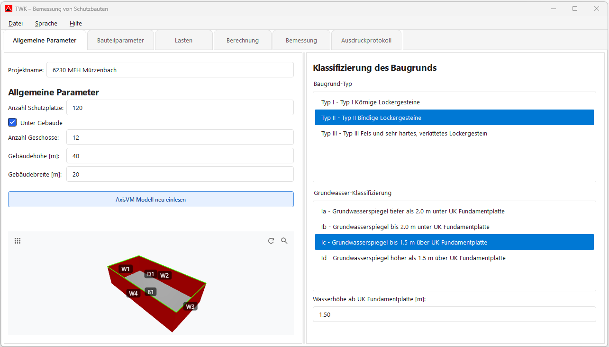
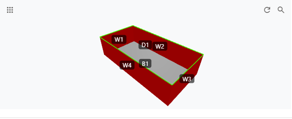
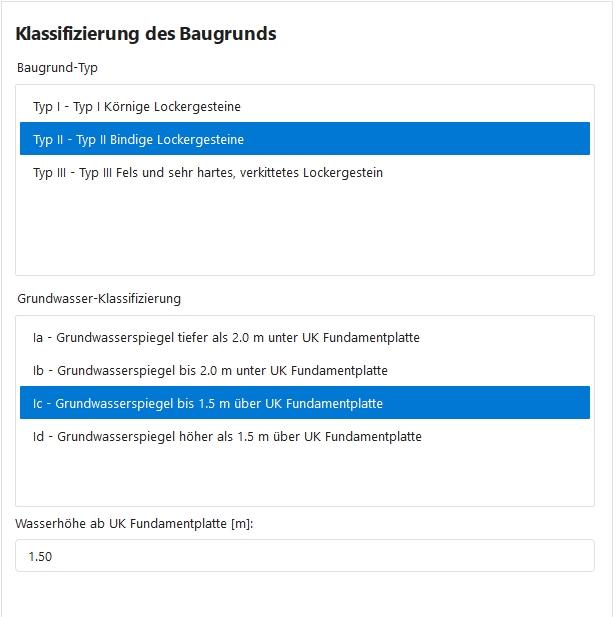

# Allgemeine Parameter

Nach dem Laden des Modells öffnet sich das Hauptfenster. Der erste Tab **„Allgemeine Parameter"** enthält die projektweiten Einstellungen der TWK-App.

---

## Projektdaten & Gebäude

### Projektname

Oben kann ein **Projektname** eingegeben werden. Änderungen werden automatisch gespeichert.

### Anzahl Schutzplätze

Anzahl der Schutzplätze für das Projekt (ganzzahlig, 0–100'000). Änderungen werden automatisch gespeichert.

### Unter Gebäude

Über die Checkbox **„Unter Gebäude"** wird festgelegt, ob sich der Schutzraum unter einem bestehenden Gebäude befindet. Ist die Checkbox aktiviert, werden zusätzliche Felder eingeblendet:

| Feld | Beschreibung |
|---|---|
| **Anzahl Geschosse** | Anzahl der Geschosse über dem Schutzraum |
| **Gebäudehöhe [m]** | Gesamthöhe des Gebäudes in Metern |
| **Gebäudebreite [m]** | Breite des Gebäudes in Metern |

> Ist die Checkbox deaktiviert, sind diese Felder ausgeblendet und werden im Modell nicht berücksichtigt.

> **Wichtig für den nächsten Tab:** Wenn **Unter Gebäude** aktiv ist und im Tab **Bauteilparameter** eine Decke als **„Decke unter Gebäuden"** zugeordnet wird, berücksichtigt die TWK-App programmintern zusätzlich auch Trümmerlasten nach TWK 2017. Bei hoher Geschosszahl können diese anstelle der Luftstosslast massgebend werden.

### AxisVM Modell neu einlesen

Mit dem Button **„AxisVM Modell neu einlesen"** kann das Modell erneut importiert werden, falls Änderungen in AxisVM vorgenommen wurden.

Beim Neu-Einlesen werden Geometrie- und Bauteildaten aus AxisVM aktualisiert. Danach wird die Bauteilliste in der TWK-App ebenfalls aktualisiert.

### 3D-Ansicht

Am unteren Rand wird eine **3D-Vorschau** des Schutzraum-Modells angezeigt.

> **Hinweis:** Eine 3D-Ansicht wird auch in den nächsten Tabs verwendet, damit Geometrie und Ergebnisse im weiteren Workflow direkt nachvollzogen werden können.

---

## Klassifizierung des Baugrunds

### Baugrundtyp

Auswahl des Baugrundtyps:

| Typ | Beschreibung |
|---|---|
| **Typ I** | Körnige Lockergesteine |
| **Typ II** | Bindige Lockergesteine |
| **Typ III** | Fels und sehr hartes, verkittetes Lockergestein |

### Grundwasser-Klassifizierung

Auswahl der Grundwassersituation:

| Klasse | Beschreibung |
|---|---|
| **Ia** | Grundwasserspiegel tiefer als 2.0 m unter UK Fundamentplatte |
| **Ib** | Grundwasserspiegel bis 2.0 m unter UK Fundamentplatte |
| **Ic** | Grundwasserspiegel bis 1.5 m über UK Fundamentplatte |
| **Id** | Grundwasserspiegel höher als 1.5 m über UK Fundamentplatte |

### Wasserhöhe ab UK Fundamentplatte [m]

Bei den Grundwasserklassen **Ic** und **Id** wird zusätzlich das Feld **„Wasserhöhe ab UK Fundamentplatte [m]"** aktiv.

- Für **Ic/Id** ist die Wasserhöhe eine Pflichtangabe (> 0).
- Die Eingabe wird später beim Lastenimport in der TWK-App automatisch für den AxisVM-Wasserdrucklastfall verwendet.
- **Wichtig:** Der Wasserdruck-Lastfall muss in AxisVM **nicht manuell** erstellt oder gepflegt werden.
- Standardwerte beim Umschalten: **Ic = 1.50 m**, **Id = 2.00 m**.

---

## Nächster Schritt

Weiter zum Tab **[Bauteilparameter](03_Bauteilparameter.md)**, um die einzelnen Bauteile zu konfigurieren.
