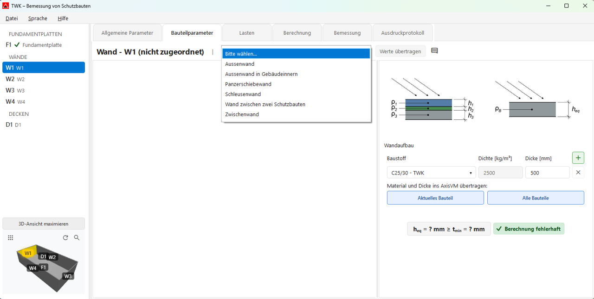
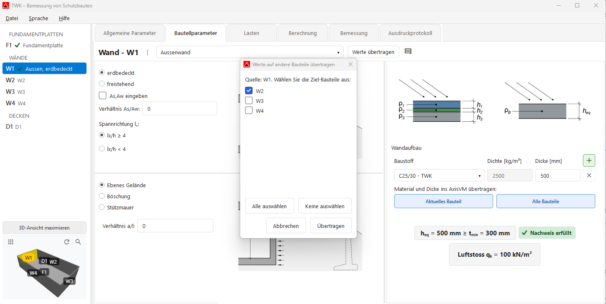
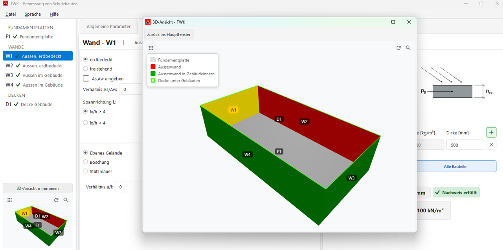
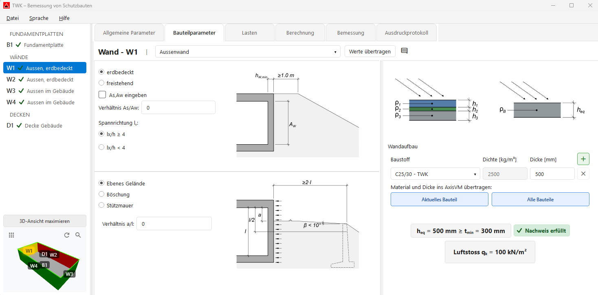
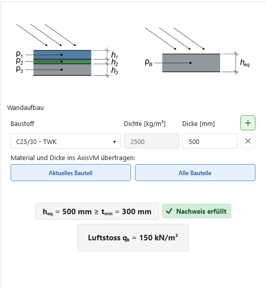

# Bauteilparameter

Im Tab **„Bauteilparameter"** legen Sie die Eigenschaften aller Bauteile fest (Wände, Decken, Fundamentplatten).  
Das gewünschte Bauteil wählen Sie links in der Seitenleiste aus.

Alle Änderungen werden laufend gespeichert und in den folgenden Tabs weiterverwendet (**Lasten**, **Berechnung**, **Bemessung**).

### Arbeitsübersicht

- **Bauteiltyp zuordnen:** Wände, Decken und Fundamentplatten erhalten ihren jeweiligen Typ.
- **Werte übertragen:** Bereits erfasste Eingaben können auf passende Bauteile desselben Typs übernommen werden.
- **Kommentare erfassen:** Pro Bauteil kann ein Kommentar hinterlegt werden.
- **3D-Ansicht maximieren:** Öffnet das 3D-Modell im separaten Fenster.

Im maximierten 3D-Fenster stehen oben folgende Icon-Buttons zur Verfügung:
- **„Legende"** (links oben): Öffnet/schliesst die Legende mit den Bauteilfarben.
- **„Zurücksetzen"** (rechts oben, Kreis-Pfeil): Setzt die Ansicht auf die Standardansicht zurück.
- **„Zoom alles"** (rechts oben, Lupe): Zoomt auf das gesamte Modell, behält aber die aktuelle Blickrichtung bei.

---

## Kopfzeile

- **Bauteilname:** Name des aktuell ausgewählten Bauteils (z. B. „Wand – W1").
- **Typ-Dropdown:** Auswahl des Bauteiltyps. Je nach Präfix stehen unterschiedliche Typen zur Verfügung:

| Präfix | Verfügbare Typen |
|---|---|
| **B** (Fundamentplatten) | Fundamentplatte |
| **W** (Wände) | Aussenwand, Aussenwand in Gebäudeinnern, Panzerschiebewand, Zwischenwand, Wand zwischen zwei Schutzbauten, Schleusenwand |
| **D** (Decken) | Decke im Freien, Decke unter Gebäuden, Zwischendecke |

- **Werte übertragen:** Kopiert aktuelle Eingaben auf andere passende Bauteile desselben Typs (W/B/D).
- **Kommentar-Button:** Öffnet das Kommentarfeld zum Bauteil (Icon zeigt an, ob bereits ein Kommentar vorhanden ist).

---

## Parameter

Die verfügbaren Eingabefelder ändern sich abhängig vom gewählten **Bauteiltyp**:

### Aussenwand
- **Erdüberdeckung:** erdbedeckt oder freistehend
- **As/Aw Verhältnis:** Flächenverhältnis (einzeln oder als Verhältnis eingebbar)

### Aussenwand in Gebäudeinnern
- **Vorraum-Typ:** weitgehend unterirdisch oder teilweise oberirdisch
- **Z-Berechnung** (bei teilweise oberirdisch): Tabelle mit Öffnungsflächen (A_i) und Abständen (x_i)
- **h_D [mm]:** Mindestwert 200 mm

### Panzerschiebewand
- **Deckenstärke Einfahrt h_d [mm]**
- **Querschnittsfläche der Einfahrt A [m²]**
- **Abstand zur Einfahrt x [m]**

### Decke im Freien
- **Dicke Erdüberdeckung [m]**
- **Erdüberdeckung Typ:** locker oder dicht gelagerter Boden

### Decke unter Gebäuden
- **Flächenverhältnis Af/Aw**
- **Masse Aussenwände:** < 300 oder ≥ 300
- **Anzahl Geschosse:** kein, eine oder mehrere

> **Hinweis:** Bei **Decke unter Gebäuden** werden in Kombination mit den Angaben aus **Allgemeine Parameter** (Unter Gebäude / Geschossangaben) intern auch Trümmerlasten nach TWK 2017 berücksichtigt.

### Zwischenwand / Wand zwischen zwei Schutzbauten / Fundamentplatte
Für diese Typen sind hier keine zusätzlichen Eingaben erforderlich; es wird ein Infotext angezeigt.

### Lastrelevante Eingaben
Zusätzliche, lastrelevante Eingaben werden im selben Bereich angezeigt (abhängig vom ausgewählten Bauteiltyp).

### Aussenwand
- **Einwirkung Erdlast:** Ebenes Gelände, Böschung oder Stützmauer
- **Verhältnis a/l** (bei Gelände/Böschung)
- **Winkel β [°]** (nur bei Böschung)

### Schleusenwand / Panzerschiebewand
- **Einwirkung:** Korridor oder Expansionsraum
- **Eintrittsquerschnitt A_E [m²]**
- **Kleinster Eintrittsquerschnitt A_(E,min) [m²]**
- **Länge Korridor L [m]** oder **Fläche Vorraum A_v [m²]** (je nach Auswahl)
- **Spannrichtung l_x:** Auswahl **lx/h ≥ 4** oder **lx/h < 4** (wirkt sich auf die Lastansätze aus).

### Aussenwand in Gebäudeinnern
- **Maximaler Öffnungsanteil α** (Wert zwischen 0 und 1)
- Das zugehörige Bild wird direkt in diesem Lastenbereich angezeigt.

---

## Eingabebilder

Rechts neben den Eingabefeldern sehen Sie bauteilabhängig **Querschnitts-** und **Grundrissbilder**.  
Die Darstellung aktualisiert sich automatisch entsprechend Bauteiltyp und Parametern.

- Bei Typen ohne Bilddarstellung wird stattdessen nur der relevante Eingabebereich bzw. ein Infotext gezeigt.
- Bilder lassen sich per Klick vergrössern.

---

## Äquivalente Bauteildicke

### Wandaufbau (Schichten)

Hier definieren Sie den Schichtaufbau des ausgewählten Bauteils:

| Spalte | Beschreibung |
|---|---|
| **Baustoff** | Material der Schicht (1. Schicht: Beton-Dropdown, weitere: Freitext) |
| **Dichte [kg/m³]** | Materialdichte (bei Beton automatisch 2500) |
| **Dicke [mm]** | Schichtdicke |

- Die **erste Schicht** ist immer Beton (C25/30 oder C30/37); die Dichte wird automatisch gesetzt.
- Mit **„+"** können bis zu **3 weitere Schichten** ergänzt werden (z. B. Dämmstoff).
- Die **äquivalente Bauteildicke h_eq** wird automatisch berechnet.

### Nachweis der minimalen Dicke

Unterhalb der Schichten-Tabelle sehen Sie den Nachweis, ob die berechnete **h_eq** die Mindestdicke **t_min** erfüllt:
- ✓ Nachweis erfüllt
- ✗ Nachweis nicht erfüllt

### Berechnete Last

Am unteren Rand wird die berechnete Last **q_k [kN/m²]** angezeigt (z. B. Luftstoss, Trümmerlast).

### AxisVM-Übertragung

- **„Aktuelles Bauteil"** – überträgt Material und Dicke nur für das aktuell ausgewählte Bauteil ins AxisVM-Modell.
- **„Alle Bauteile"** – überträgt Material und Dicke für alle Bauteile ins AxisVM-Modell.

---

## Nächster Schritt

Weiter zum Tab **[Lasten](04_Lasten.md)**, um die Lastfälle zu importieren und zuzuweisen.
