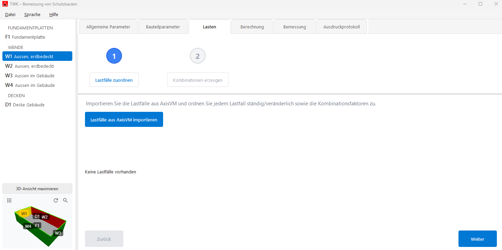
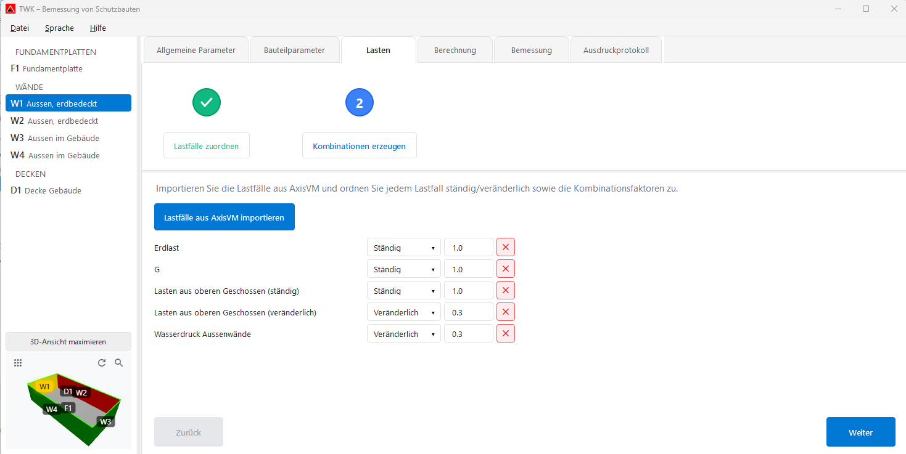
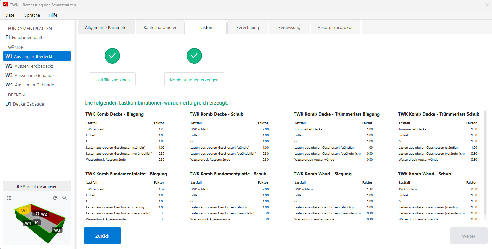

# Lasten

Im Tab **„Lasten"** werden die Lastfälle aus AxisVM importiert, zugeordnet und zu Lastkombinationen zusammengestellt. Der Ablauf erfolgt in **2 Schritten**.

---

## Schritt 1: Lastfälle zuordnen

Falls noch keine Lastfälle vorhanden sind, können diese über **„Lastfälle aus AxisVM importieren"** eingelesen werden.
Die TWK-spezifischen Leiteinwirkungen werden dabei automatisch erstellt (nicht aus AxisVM importiert).

Für jeden importierten Lastfall wird festgelegt:

| Spalte | Beschreibung |
|---|---|
| **Name** | Name des Lastfalls (aus AxisVM) |
| **Ständig / Veränderlich** | Dropdown: Art der Einwirkung |
| **Kombinationsfaktor** | Faktor für die Lastkombination (Standard: 1.0 bei ständig, 0.3 bei veränderlich) |
| **Löschen** | Lastfall in der TWK-App entfernen (✕-Button), bleiben im AxisVM-Modell vorhanden |

- Änderungen werden **sofort gespeichert**.
- Alle Faktoren müssen ausgefüllt sein, bevor mit Schritt 2 fortgefahren werden kann.

---

## Schritt 2: Kombinationen erzeugen

Die Lastkombinationen werden **automatisch erzeugt**, sobald Schritt 2 geöffnet wird.
Im Standardfall entstehen **mindestens 6 Basiskombinationen**:

| Kombination | Bauteiltyp | Nachweis |
|---|---|---|
| TWK Komb Wand – Biegung | Wand | Biegung |
| TWK Komb Decke – Biegung | Decke | Biegung |
| TWK Komb Fundamentplatte – Biegung | Fundamentplatte | Biegung |
| TWK Komb Wand – Schub | Wand | Schub |
| TWK Komb Decke – Schub | Decke | Schub |
| TWK Komb Fundamentplatte – Schub | Fundamentplatte | Schub |

Je nach Modell werden zusätzlich weitere Kombinationen erzeugt:
- **Schockbelastung** (z. B. Fundamentplatten ohne Flächenlager, Zwischendecken): zusätzliche **+ / -**-Kombinationen.
- **Trümmerlasten** (z. B. Decke unter Gebäuden): zusätzliche Trümmerlast-Kombinationen für Biegung/Schub.

Jede Kombination zeigt in einer Übersicht die enthaltenen Lastfälle mit ihren Faktoren.

---

## Navigation

- **„Zurück"** und **„Weiter"** Buttons unten zum Wechseln zwischen den Schritten.
- Der Stepper oben zeigt den aktuellen Fortschritt (grün = abgeschlossen, blau = aktiv).

---

## Nächster Schritt

Weiter zum Tab **[Berechnung](05_Berechnung.md)**, um die FE-Berechnung zu starten.
