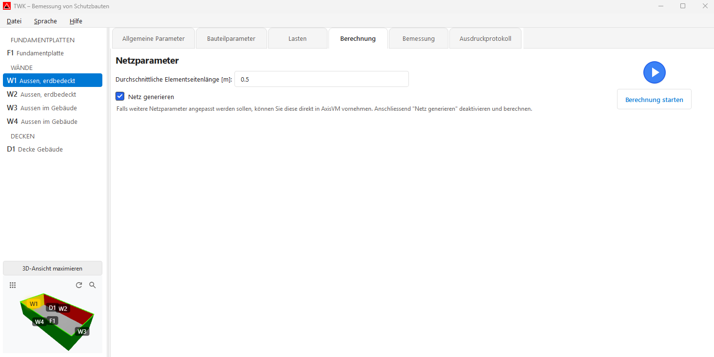
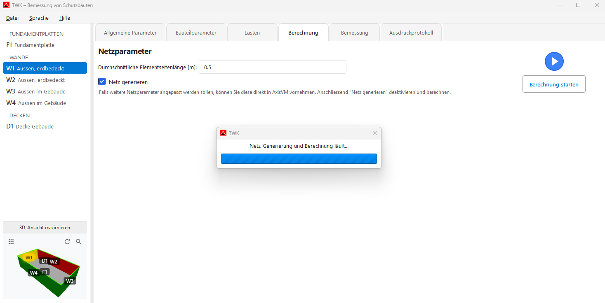

# Berechnung

Im Tab **„Berechnung"** starten Sie die Finite-Elemente-Berechnung.  
Hier legen Sie die Netzparameter fest und führen die Berechnung aus.

---

## Netzparameter

### Durchschnittliche Elementseitenlänge

- Eingabefeld für die gewünschte Elementgrösse in **Metern** (Standard: 0.5 m).
- Kleinere Werte bedeuten ein feineres Netz und meist genauere Ergebnisse, aber auch längere Rechenzeit.

### Netz generieren (Checkbox)

- **Aktiviert (Standard):** Das Netz wird vor der Berechnung automatisch generiert.
- **Deaktiviert:** Nützlich, wenn das Netz bereits in AxisVM manuell angepasst wurde und beibehalten werden soll.

> **Hinweis:** Wenn weitere Netzparameter angepasst werden sollen, können Sie dies direkt in AxisVM machen. Anschliessend **„Netz generieren"** deaktivieren und berechnen.

---

## Berechnung starten

Zum Starten der Berechnung auf den **blauen Kreis** oder auf **„Berechnung starten"** klicken.

### Status-Anzeige

| Symbol | Bedeutung |
|---|---|
| 🔵 Blauer Kreis (▶) | Bereit – Berechnung kann gestartet werden |
| 🟢 Grüner Kreis (✓) | Berechnung erfolgreich abgeschlossen |
| 🔴 Roter Kreis (✗) | Fehler bei der Berechnung |

### Ablauf der Berechnung

1. **Netz-Generierung** (falls aktiviert) – das Dreiecksnetz wird erzeugt.
2. **Linear-elastische Analyse** – FE-Berechnung wird in AxisVM durchgeführt.
3. **Ergebnisextraktion** – Ergebnisse werden aus AxisVM ausgelesen.
4. **Bewehrungsinitialisierung** – Bewehrung wird automatisch initialisiert.

Während der Berechnung wird ein **Fortschrittsdialog** angezeigt. Je nach Modell kann die Berechnung einige Minuten dauern.

Nach erfolgreicher Berechnung wechselt die Ansicht automatisch zum Tab **Bemessung**.

---

## Nächster Schritt

Weiter zum Tab **[Bemessung](06_Bemessung.md)**, um die Bewehrung zu entwerfen.
