# Bemessung

Im Tab **„Bemessung"** wird die Bewehrung für Biegung und Schub festgelegt, geprüft und bei Bedarf automatisch optimiert.

---

## Einstieg und Arbeitsweise

Beim Einstieg in den Tab erscheint zuerst das Fenster **„Allgemeine Bewehrungsparameter"**.  
Hier werden die globalen Vorgaben für die Bemessung festgelegt.
Auf dieser Basis kann die Bewehrung anschliessend mit einem Klick optimiert und direkt übernommen werden. Beim Optimieren wählt die TWK-App je Bereich bzw. Bauteil automatisch die kleinste passende Bewehrung aus den freigegebenen Kombinationen, aktualisiert die Berechnungen und bewertet die Nachweise neu.

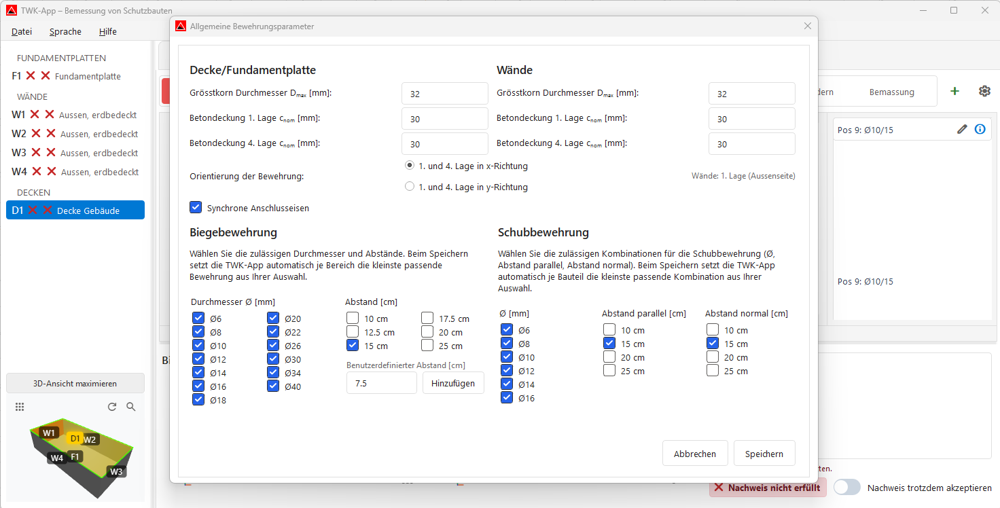

Der Dialog enthält getrennte Bereiche für **Decke/Fundamentplatte** und **Wände**:

- Grösstkorn-Durchmesser `D_max`
- Betondeckung `c_nom` (1. und 4. Lage)
- Orientierung der Bewehrung
- Synchrone Anschlusseisen
- Auswahl der zulässigen Kombinationen für Biege- und Schubbewehrung

Diese Vorgaben gelten global; bauteilspezifische Anpassungen erfolgen später über **Bauteil-Bewehrungsparameter**.

Typischer Ablauf im Tab:

1. Allgemeine Parameter prüfen oder anpassen
2. Zwischen Biegebemessung und Schubbemessung wechseln
3. Bereiche in Skizze/Liste bearbeiten und Ergebnisse unten kontrollieren
4. Nachweise beurteilen und bei Bedarf kommentiert akzeptieren

---

## Umschalten und Statusanzeige

Oben wird zwischen **Biegebemessung** und **Schubbemessung** umgeschaltet.  
Bei der Biegebemessung kann zusätzlich zwischen **Lage 1 bis Lage 4** gewechselt werden.

Die Statusfarben werden durchgängig verwendet:

- 🟢 Grün = Nachweis erfüllt
- 🟠 Orange = Nachweis nicht erfüllt, aber trotzdem akzeptiert
- 🔴 Rot = Nachweis nicht erfüllt

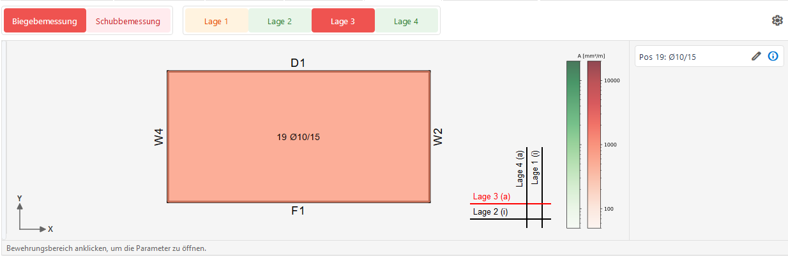

---

## Biegebemessung

### Überblick

Die Biegebemessung ist in einen oberen Bearbeitungsbereich und einen unteren Ergebnisbereich gegliedert.

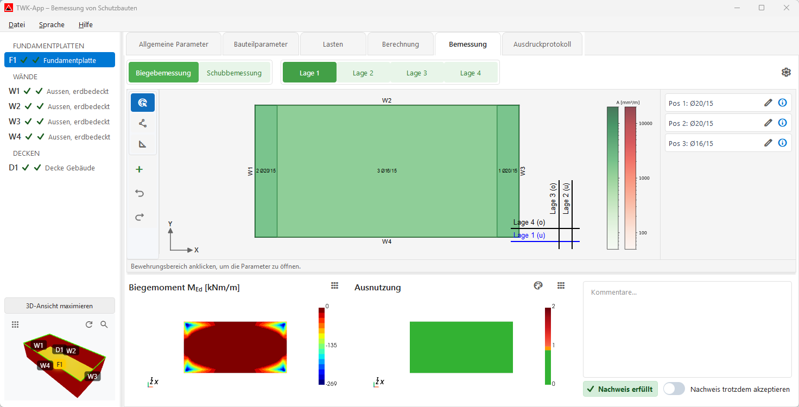

### Oberer Bereich: Skizze und Liste

- **Links:** interaktive Bewehrungsskizze des ausgewählten Bauteils
- **Rechts:** Bewehrungsliste mit Positionen und Kennwerten

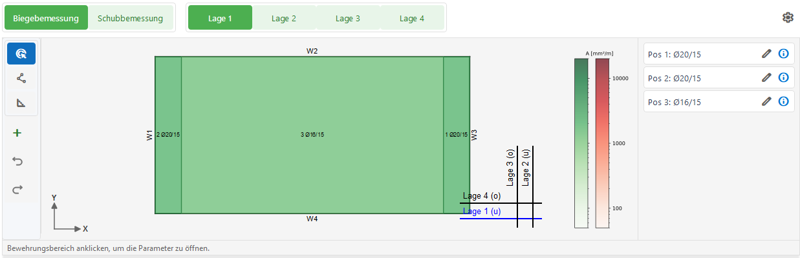

### Unterer Bereich: Ergebnisansichten

Im unteren Bereich werden drei Ansichten angezeigt:

1. Linke Ergebnisansicht (frei umschaltbar)
2. Mittlere Ergebnisansicht (frei umschaltbar)
3. Kommentar- und Nachweisbereich

Über die Menüs **„Ansicht wechseln"** können linke und mittlere Ergebnisansicht unabhängig voneinander eingestellt werden.

In der **Biegebemessung** stehen pro Anzeige folgende Darstellungen zur Verfügung:

- `M_Ed` (Biegemoment)
- `M_Rd` (Biegewiderstand)
- `Ausnutzung`
- `Mindestbewehrung`
- `A_s,erf` (erforderliche Bewehrung)

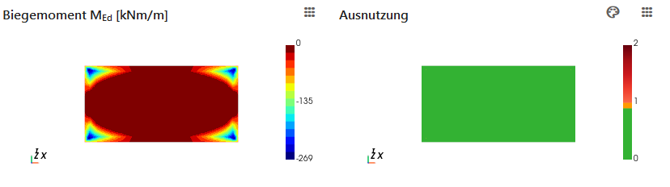

Für Ausnutzungsdarstellungen kann die Skala zwischen **3-farbig** und **2-farbig** umgeschaltet werden.

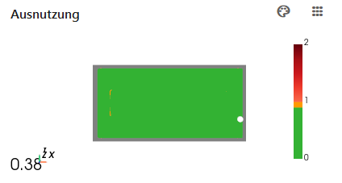

### Kommentar und Nachweis

Wenn ein Nachweis nicht erfüllt ist, kann er über **„Nachweis trotzdem akzeptieren"** freigegeben werden.  
In diesem Fall ist ein Kommentar verpflichtend.
Solange der Pflichtkommentar fehlt, sind Wechsel- und Auswahlaktionen im Tab eingeschränkt.

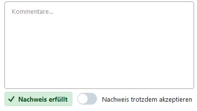
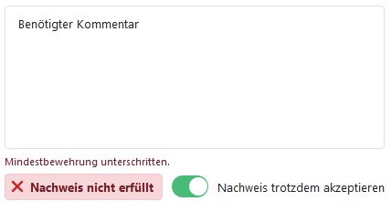

---

## Schubbemessung

Der Aufbau folgt derselben Logik wie bei der Biegebemessung:

- oberer Bereich mit Skizze und Liste
- unterer Bereich mit Ergebnisansichten und Kommentarstatus

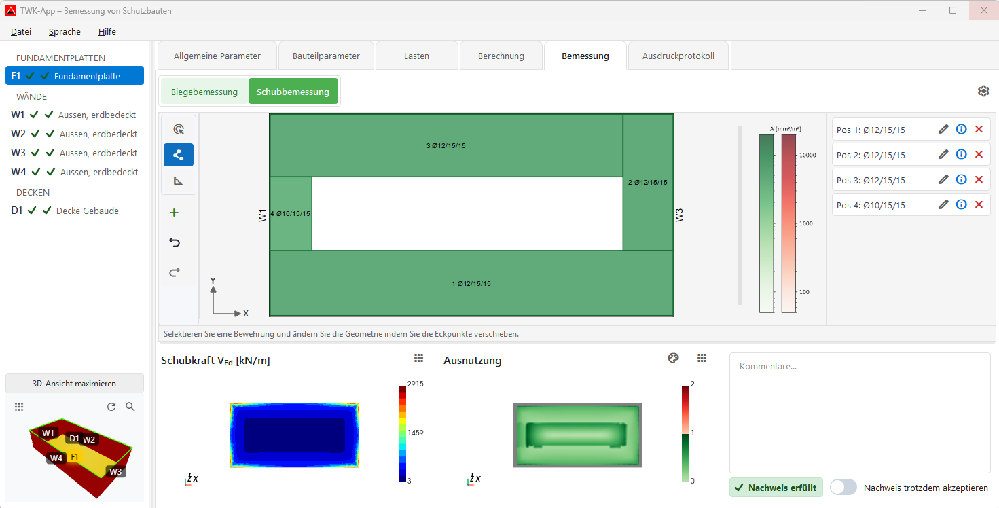

### Oberer Bereich: Skizze und Liste

Die Schubbewehrung wird in der Skizze bearbeitet und in der Liste positionsweise geführt.

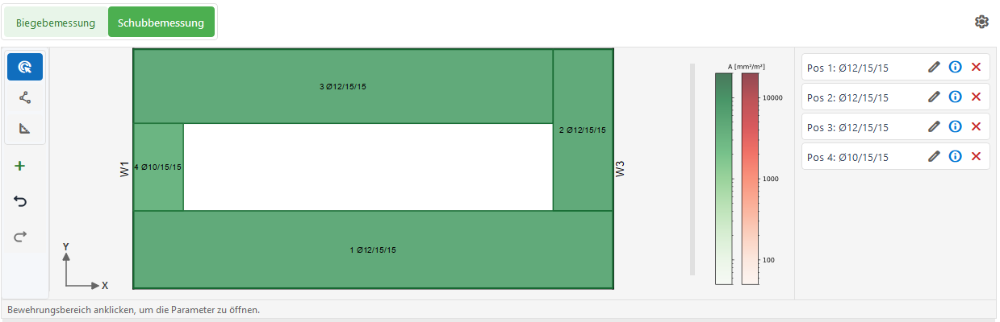

### Unterer Bereich: Ergebnisansichten

Auch in der Schubbemessung lassen sich linke und mittlere Ergebnisansicht unabhängig über das jeweilige Menü umschalten.

In der **Schubbemessung** stehen folgende Darstellungen zur Verfügung:

- **Linke Anzeige:** `V_Ed`, `V_Rd`, `Ausnutzung`, `A_s,erf`
- **Mittlere Anzeige:** `V_Ed`, `V_Rd`, `Ausnutzung`

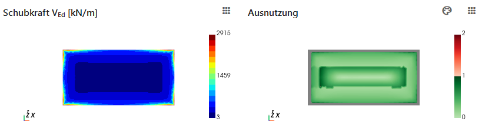

---

## Werkzeuge und Bedienung

Die vertikale Toolbar enthält die Bearbeitungsmodi und Aktionen:

- **Selektieren**
- **Geometrie ändern**
- **Bemassung**
- **+** (Biegung: Zulagen hinzufügen / Schub: Schubbewehrung hinzufügen)
- **Rückgängig**
- **Wiederholen**

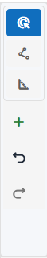

### Modus „Selektieren"

- Bewehrungsbereich anklicken, um die zugehörigen Parameter zu öffnen.
- Markierte Bereiche werden in Skizze und Liste synchron hervorgehoben.

### Modus „Geometrie ändern"

- Bewehrungsbereich auswählen, dann Eckpunkte (Knoten) mit der Maus verschieben.
- **Shift** beim Ziehen hält die Bewegung orthogonal (horizontal/vertikal).
- Mehrere Knoten können gemeinsam verschoben werden: zusätzliche Knoten mit **Ctrl** auswählen und dann als Gruppe ziehen.
- Für eine parallele Kantenverschiebung können zwei benachbarte Knoten gemeinsam markiert und zusammen verschoben werden.

### Modus „Bemassung"

- Zwei Punkte in der Skizze wählen, um eine Bemassungslinie zu erstellen.
- **Shift** hält die Bemassung orthogonal.

### „+“ Bewehrung hinzufügen (Zulage / Schubbewehrung)

Beim Hinzufügen wird ein Zeichenmodus mit Koordinatenleiste aktiviert:

- **Insert** setzt den Koordinaten-Ursprung an die aktuelle Cursorposition (dX/dY werden auf 0 gesetzt).
- **X** oder **Y** springt direkt in das jeweilige Koordinaten-Eingabefeld.
- **Enter** übernimmt die Eingabe und setzt den nächsten Punkt exakt.
- **L** öffnet die Längeneingabe für den aktuellen Segmentabschnitt.
- **Esc** oder Rechtsklick bricht den laufenden Zeichenvorgang ab.

### Rückgängig / Wiederholen

- **Ctrl+Z**: Rückgängig
- **Ctrl+Y**: Wiederholen

---

## Einstellungen (Zahnrad-Icon)

Über das Zahnrad-Menü stehen folgende Dialoge zur Verfügung:

- **Allgemeine Bewehrungsparameter**
- **Bauteil-Bewehrungsparameter**
- **Einheiten**

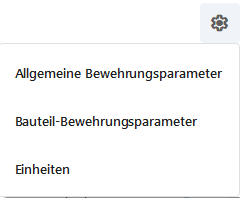
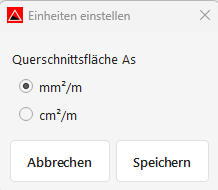

---

## Nächster Schritt

Weiter zum Tab **[Ausdruckprotokoll](07_Ausdruckprotokoll.md)**, um den PDF-Bericht zu erstellen.
