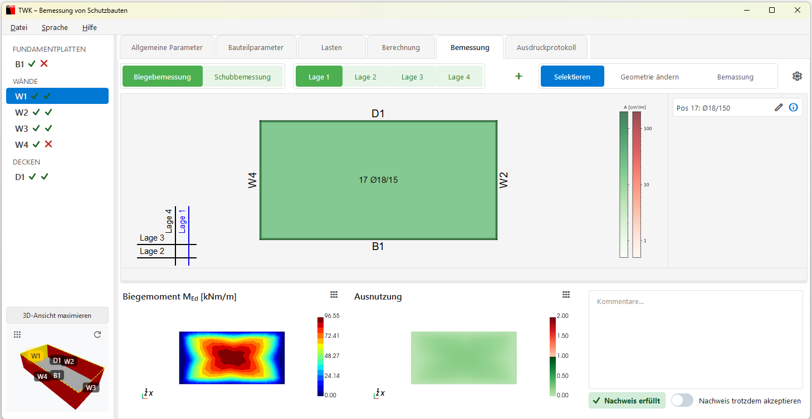
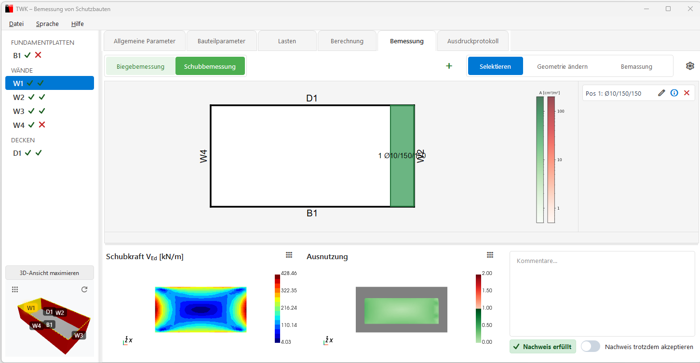

# Bemessung

Im Tab **„Bemessung"** wird die Bewehrung für Biegung und Schub entworfen und geprüft.

---

## Allgemeine Bewehrungsparameter

Vor der eigentlichen Bemessung sollten die **Allgemeinen Bewehrungsparameter** geprüft werden. Diese werden über das **Zahnrad-Icon** (⚙) oben rechts → **„Bewehrungsparameter"** geöffnet.

Der Dialog enthält getrennte Einstellungen für **Decke/Fundamentplatte** und **Wände**:

| Parameter | Beschreibung |
|---|---|
| **Stabdurchmesser Ø [mm]** | Durchmesser der Bewehrungsstäbe (Dropdown, z. B. 10 mm) |
| **Stababstand s [cm]** | Abstand zwischen den Stäben (z. B. 15.0 cm) |
| **Grösstkorn Durchmesser D_max [mm]** | Maximaler Korndurchmesser des Betons (z. B. 32 mm) |
| **Betondeckung 1. Lage c_nom [mm]** | Betondeckung der äusseren Bewehrungslage (z. B. 30 mm) |
| **Betondeckung 4. Lage c_nom [mm]** | Betondeckung der inneren Bewehrungslage (z. B. 30 mm) |
| **Orientierung der Bewehrung** | 1. und 4. Lage in x-Richtung oder y-Richtung |
| **Synchrone Anschlusseisen** | Checkbox für synchrone Anschlussbewehrung |

> Diese Parameter gelten für **alle Bauteile**. Für bauteilspezifische Anpassungen gibt es zusätzlich die **Bauteil-Bewehrungsparameter** (ebenfalls über das Zahnrad-Icon).

---

## Umschalten: Biegung / Schub

Oben kann zwischen **Biegebemessung** und **Schubbemessung** umgeschaltet werden.

Über den **Segmented Control** oben wird gewählt:

- **Biegebemessung** – Bewehrung gegen Biegemomente
- **Schubbemessung** – Bewehrung gegen Schubkräfte

Die Buttons zeigen farbig den **Nachweissstatus** an:
- 🟢 Grün = Nachweis erfüllt
- 🟠 Orange = Nicht erfüllt, aber akzeptiert
- 🔴 Rot = Nicht erfüllt

---

## Biegebemessung

### Bewehrungslagen (Lage 1–4)

Bei der Biegebemessung kann zwischen **4 Bewehrungslagen** gewechselt werden (Lage 1, Lage 2, Lage 3, Lage 4). Jede Lage hat eine eigene Bewehrungsskizze und -liste.

### Oberer Bereich

| Links: Bewehrungsskizze | Rechts: Bewehrungsliste |
|---|---|
| 2D-Draufsicht des Bauteils mit farbigen Bewehrungsflächen | Scrollbare Liste aller Bewehrungspositionen |

**Bewehrungsskizze:**
- Zeigt das Bauteil als Polygon mit farbig dargestellten Bewehrungsbereichen.
- Interaktiv: Auswählen, Geometrie bearbeiten, Bemassung hinzufügen.
- Farbskala rechts zeigt die Bewehrungswerte.

**Bewehrungsliste:**
- Jeder Eintrag zeigt: Position, Durchmesser (Ø) und Abstand (z. B. „Pos 1: Ø12/150").
- Aktionen pro Eintrag: Bearbeiten, Info, Löschen.
- Hover über einen Eintrag markiert den Bereich in der Skizze (und umgekehrt).

<!-- TODO: Screenshot einfügen -->

### Unterer Bereich: 3D-Visualisierungen

Drei Ansichten nebeneinander:

| Ansicht 1 | Ansicht 2 | Ansicht 3 |
|---|---|---|
| Biegemoment M_Ed [kNm/m] | Ausnutzung | Kommentar & Status |

Über das **Dropdown-Menü (⋮)** kann die Darstellung umgeschaltet werden:
- Biegemoment M_Ed [kNm/m]
- Biegewiderstand M_Rd [kNm/m]
- Ausnutzung
- Mindestbewehrung [cm²/m]

**Kommentar-Bereich:**
- Zeigt den Nachweisstatus: **„Nachweis erfüllt"** (grün) oder **„Nachweis nicht erfüllt"** (rot).
- Falls der Nachweis nicht erfüllt ist, kann er mit **„Nachweis trotzdem akzeptieren"** akzeptiert werden – ein Kommentar ist dann **Pflicht**.

---

## Schubbemessung

Der Aufbau ist analog zur Biegebemessung:

### Oberer Bereich

| Links: Schubbewehrungsskizze | Rechts: Schubbewehrungsliste |
|---|---|
| 2D-Draufsicht mit Schubbewehrungsbereichen | Liste mit Position, Ø, Abstand parallel/normal |

Jeder Eintrag zeigt z. B.: „Pos 1: Ø12/150/200" (Durchmesser / Abstand parallel / Abstand normal).

### Unterer Bereich: 3D-Visualisierungen

| Ansicht 1 | Ansicht 2 | Ansicht 3 |
|---|---|---|
| Schubkraft V_Ed [kN/m] | Ausnutzung | Kommentar & Status |

Umschaltbar auf:
- Schubkraft V_Ed [kN/m]
- Schubwiderstand V_Rd [kN/m]
- Ausnutzung

<!-- TODO: Screenshot einfügen -->

---

## Werkzeuge (Toolbar)

| Werkzeug | Funktion |
|---|---|
| **Selektieren** | Bewehrungsbereiche auswählen |
| **Geometrie ändern** | Eckpunkte der Bewehrungsbereiche verschieben |
| **Bemassung** | Masslinien in der Skizze hinzufügen |
| **+ (Plus-Button)** | Neue Bewehrung hinzufügen (Zulage bzw. Schubbewehrung) |

---

## Einstellungen (Zahnrad-Icon)

Über das Zahnrad-Icon oben können geöffnet werden:
- **Bewehrungsparameter** – Allgemeine Parameter für alle Bauteile
- **Bauteil-Bewehrungsparameter** – Parameter für das aktuelle Bauteil (Betondeckung, Orientierung, Korngrösse)

---

## Nächster Schritt

Weiter zum Tab **[Ausdruckprotokoll](07_Ausdruckprotokoll.md)**, um den PDF-Bericht zu erstellen.
