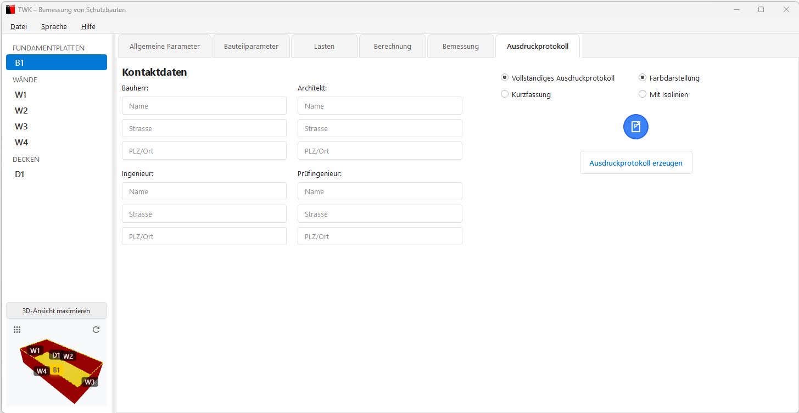
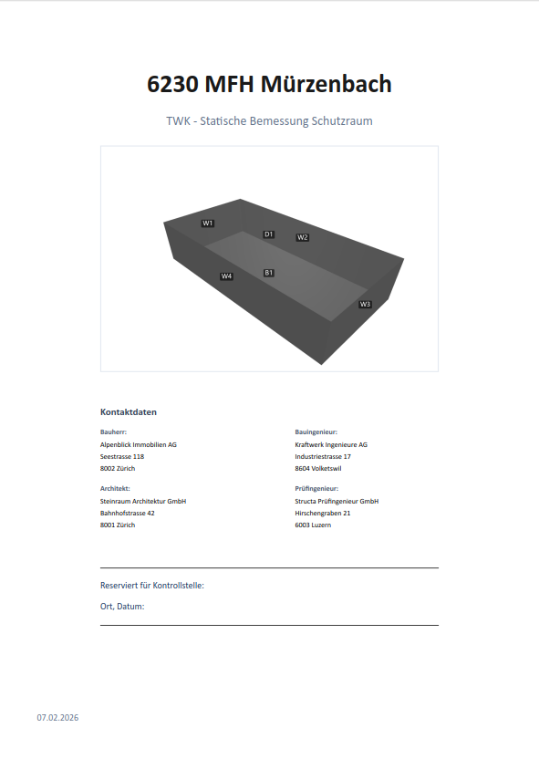

# Ausdruckprotokoll

Im Tab **„Ausdruckprotokoll"** wird der PDF-Bericht für die Schutzraumbemessung erzeugt.

<!-- TODO: Screenshot einfügen -->

---

## Berichtstyp wählen

| Option | Beschreibung |
|---|---|
| **Vollständiges Ausdruckprotokoll** | Kompletter Bericht mit allen Kapiteln (Standard) |
| **Kurzfassung** | Kompakte Version ohne Lastfälle/Kapitel 2 |

### Darstellungsart (nur bei vollständigem Protokoll)

| Option | Beschreibung |
|---|---|
| **Farbdarstellung** | Farbcodierte Diagramme (Standard) |
| **Mit Isolinien** | Darstellung mit Konturlinien |

---

## Kontaktdaten (linke Seite)

Folgende Angaben müssen ausgefüllt werden (Pflichtfelder):

| Rolle | Felder |
|---|---|
| **Bauherr** | Name, Strasse, PLZ/Ort |
| **Architekt** | Name, Strasse, PLZ/Ort |
| **Ingenieur** | Name, Strasse, PLZ/Ort |
| **Prüfingenieur** | Name, Strasse, PLZ/Ort |

Die Kontaktdaten werden automatisch gespeichert und beim nächsten Öffnen wieder geladen.

> **Hinweis:** Alle Felder müssen ausgefüllt sein, bevor das PDF erzeugt werden kann. Leere Felder werden rot markiert.

---

## PDF erzeugen

1. Auf **„Ausdruckprotokoll erzeugen"** klicken (oder den Status-Kreis).
2. **Speicherort wählen** – ein Dateidialog öffnet sich.
   - Vorgeschlagener Dateiname: `{Projektname} Schutzraumbemessung.pdf`
3. Die Erzeugung läuft – ein Fortschrittsdialog zeigt den Status.
4. Nach Abschluss erscheint eine **Erfolgsmeldung** mit dem Speicherpfad.

### Status-Anzeige

| Symbol | Bedeutung |
|---|---|
| 🔵 Blauer Kreis | Bereit – PDF kann erzeugt werden |
| 🟢 Grüner Kreis (✓) | PDF erfolgreich erzeugt |
| 🔴 Roter Kreis (✗) | Fehler beim Erzeugen |

---

## Inhalt des PDF-Berichts

### Deckblatt
- Projektname, 3D-Ansicht, Kontaktdaten, Datum

### Kapitel 1: Grundlagen
- Normen (TWK 2017, SIA 262, SIA 261)
- Bemessungsart, Software-Versionen
- Baustoffe (Beton und Stahl)
- Baugrund und Grundwasser
- Gebäudedaten und Bauteile-Übersicht
- 3D-Ansicht und Bewehrungszusammenfassung

### Kapitel 2: Lastfälle und Lastkombinationen (nur Vollversion)
- Screenshots der Lastfälle aus AxisVM
- Tabellen der Lastkombinationen mit Faktoren

### Kapitel 3+: Bauteile (je ein Kapitel pro Bauteil)
- Allgemeine Parameter des Bauteils
- Schichtaufbau und äquivalente Dicke
- Bewehrungsparameter
- Biegebemessung: Skizzen, Momentendiagramme, Ausnutzung, Nachweistabellen
- Schubbemessung: Skizzen, Schubkraftdiagramme, Ausnutzung, Nachweistabellen

<!-- TODO: Screenshot einfügen -->
