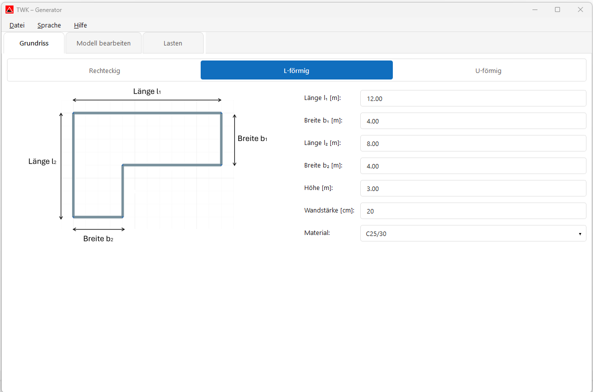

# Grundriss

Im AxisVM Modellgenerator wird im Bereich **Grundriss** die Grundform des Schutzraums festgelegt.

- Grundrisstyp auswählen (z. B. rechteckig, L-förmig, U-förmig)
- Geometrieparameter eingeben
- Vorschau prüfen

> Hinweis: Beim Wechsel des Grundrisstyps können bereits vorgenommene Änderungen in den folgenden Tabs verloren gehen.

---

## Nächster Schritt

Weiter zu **[Modell bearbeiten](08_2_Modell_bearbeiten.md)**.
