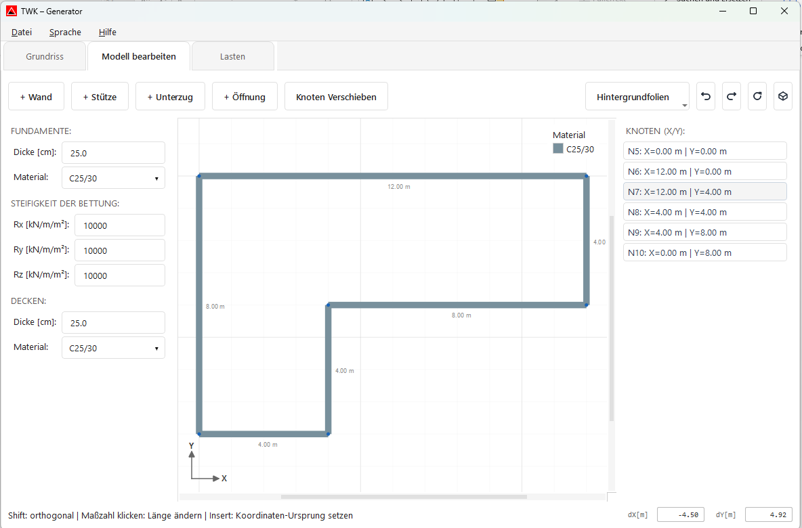
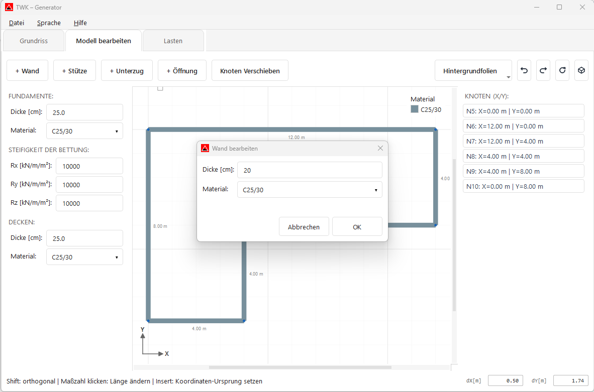
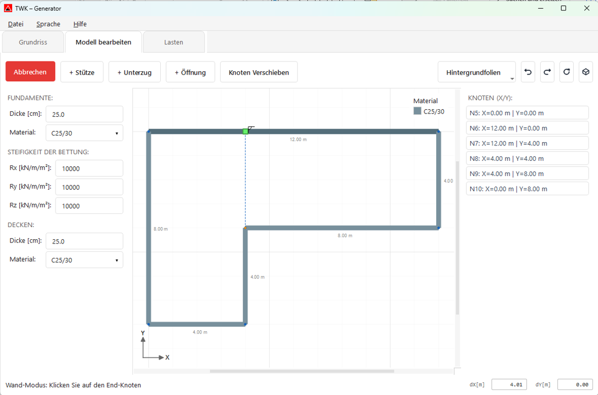
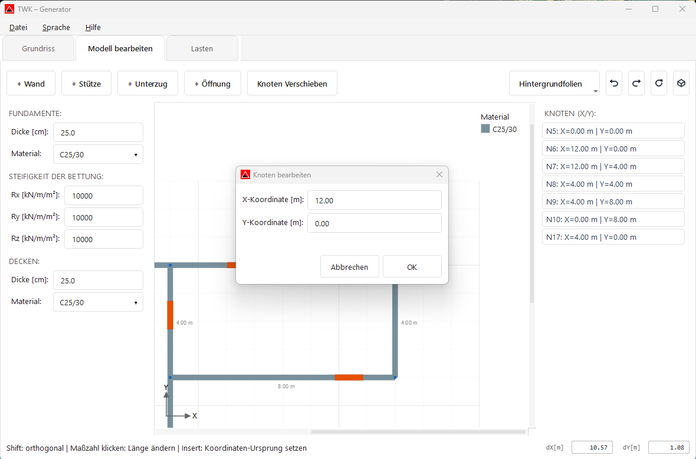
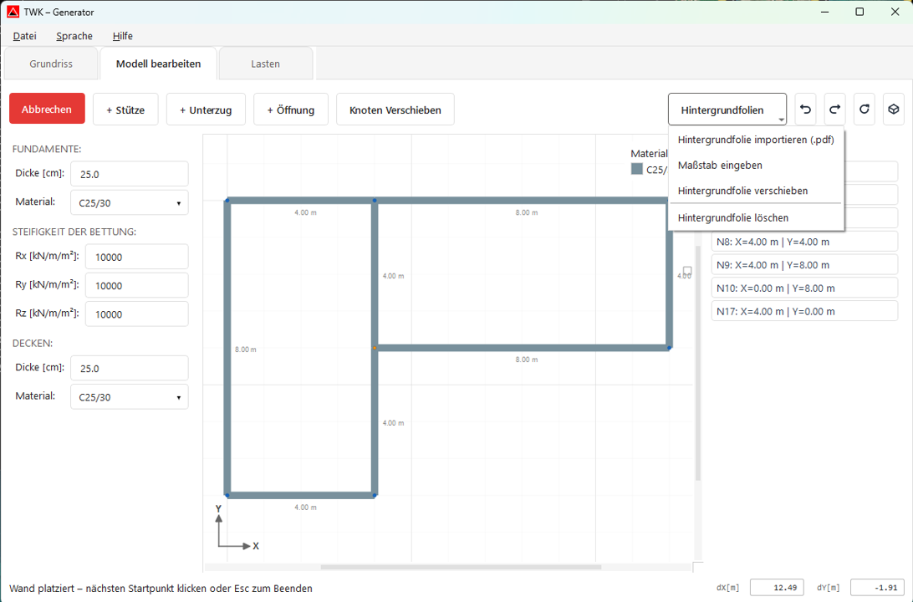
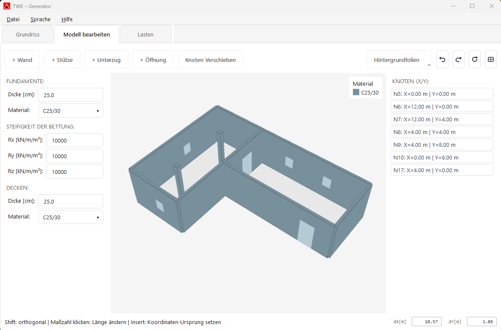

# Modell bearbeiten

Im AxisVM Modellgenerator wird im Bereich **Modell bearbeiten** die Geometrie weiterbearbeitet.

## Bedienung in Modell bearbeiten

- **Neue Wand zeichnen:** Auf **„+ Wand"** klicken, Start-Knoten anklicken, danach End-Knoten anklicken. Danach kann direkt die nächste Wand gesetzt werden; der Wandmodus wird mit **Esc** oder per Klick auf den **Abbrechen**-Button beendet.
- **Weitere Bauteile erfassen:** Analog zum Wandmodus können auch **Stützen**, **Unterzüge** und **Öffnungen** über die jeweiligen Buttons aktiviert und im Modell platziert werden.
- **Längen direkt ändern:** Eine **Maßzahl** anklicken und den Wert direkt eingeben, um die Geometrie präzise anzupassen.
- **Vorhandene Elemente bearbeiten/löschen:** Bereits platzierte Wände, Stützen, Unterzüge und Öffnungen können bearbeitet werden; selektierte Elemente lassen sich mit **Delete** oder über das Kontextmenü löschen.
- **Bauteilparameter in der Seitenleiste:** Zusätzlich können für **Fundament** und **Decken** Dicke/Material sowie die **Bettungssteifigkeit (Rx, Ry, Rz)** gepflegt werden.

Beim Start des Wandmodus öffnet sich ein Dialog zur Eingabe der Wandparameter (z. B. Dicke und Material). Diese Werte gelten für die neu gezeichnete Wand.

- **Neuen Knoten in einer Wand hinzufügen:** Mit der **rechten Maustaste** auf die gewünschte Stelle der Wand klicken und im Kontextmenü **„Knoten hinzufügen"** wählen.
- **Zwei Wände verschneiden/teilen:** Die beiden Wände (und den verbindenden Knoten, falls bereits vorhanden) auswählen, dann mit **rechter Maustaste** das Kontextmenü öffnen und **„Wände teilen"** wählen.
- **Wände über Knoten verbinden:** Den gemeinsamen Knoten markieren (an dem genau zwei passende Wände hängen), dann per **rechter Maustaste** im Kontextmenü **„Wände verbinden"** wählen.
- **Orthogonal zeichnen:** Während dem Zeichnen **Shift** gedrückt halten, um horizontal/vertikal auszurichten. Sobald die Ausrichtung greift, wird ein **Ortho-Symbol** eingeblendet.

- **Koordinaten rechts bearbeiten:** In der rechten Spalte einen Knoten in der Koordinatenliste auswählen. Danach können die Koordinaten direkt bearbeitet werden.

- **Koordinaten-Ursprung setzen:** Maus auf die gewünschte Position bewegen und **Insert** drücken (alternativ **Alt+Shift**). Der Ursprung wird auf diese Position gesetzt.
- **dX/dY unten rechts nutzen:** Rechts unten im Statusbereich stehen die Felder **dX[m]** und **dY[m]** zur präzisen Eingabe zur Verfügung. Mit **X** oder **Y** springt der Cursor direkt in das jeweilige Eingabefeld. Im Modus **Knoten verschieben** einen Knoten wählen, dX/dY eingeben und mit **Enter** bestätigen.
- **Knoten verschieben (empfohlener Ablauf):**
  1. Button **„Knoten verschieben"** aktivieren.
  2. Gewünschten Knoten markieren (genau 1 Knoten).
  3. Maus auf die gewünschte Zielposition bewegen und **Insert** drücken (setzt dort den Koordinaten-Ursprung).
  4. Unten rechts **dX/dY** eingeben und mit **Enter** bestätigen, um den Knoten präzise zu verschieben (mit **X** oder **Y** springt der Cursor direkt ins jeweilige Feld).
- **Icon-Buttons in der Toolbar:** **Undo (Rückgängig)**, **Redo (Wiederholen)** und **Zurücksetzen** (Ansicht wieder einpassen/zentrieren).
- **Nützliche Shortcuts:** **Ctrl+Z** (Rückgängig), **Ctrl+Y** (Wiederholen), **Delete** (Auswahl löschen), **F** (Ansicht einpassen).

## Hintergrundfolien (PDF)

Über den Button **„Hintergrundfolien"** können PDF-Pläne als Zeichenhilfe hinterlegt werden.

1. **Hintergrundfolie importieren (.pdf):** Lädt die erste Seite der PDF in den Editor.
2. **Maßstab eingeben:** Zwei Referenzpunkte in der PDF anklicken (Punkt A und Punkt B) und danach die reale Distanz eingeben.
3. **Hintergrundfolie verschieben:** PDF mit linker Maustaste ziehen; fein verschieben ist auch mit den Pfeiltasten möglich.
4. **Hintergrundfolie löschen:** Entfernt die geladene Folie wieder.

## 3D-Ansicht

Über den 3D-Button kann zwischen 2D- und 3D-Darstellung umgeschaltet werden.

- Die 3D-Ansicht hilft bei der schnellen Plausibilitätsprüfung der Geometrie.
- Änderungen im Modell können so direkt räumlich kontrolliert werden.

---

## Nächster Schritt

Weiter zu **[Lasten](08_3_Lasten.md)**.
