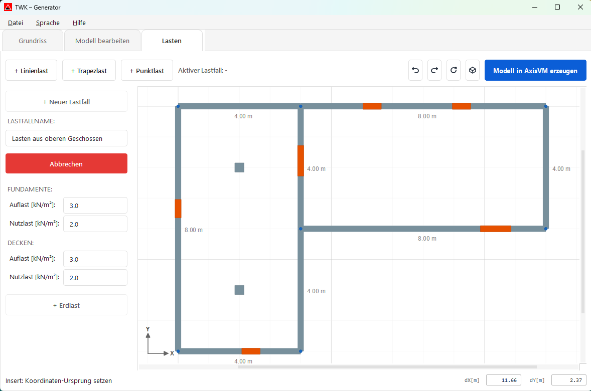
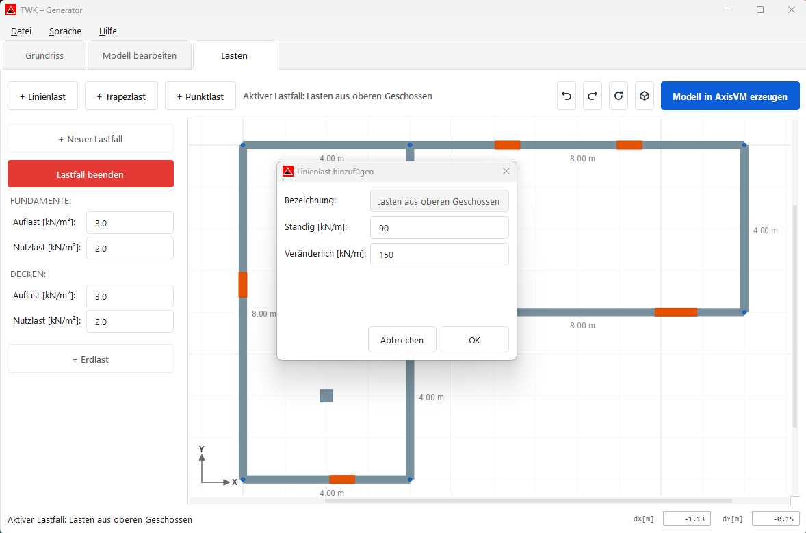
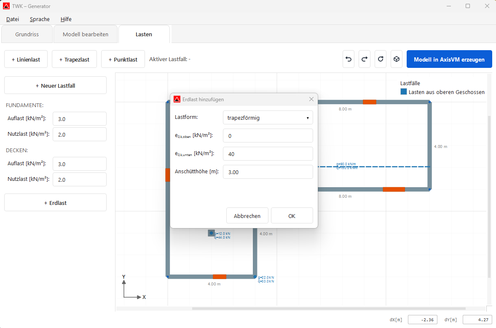
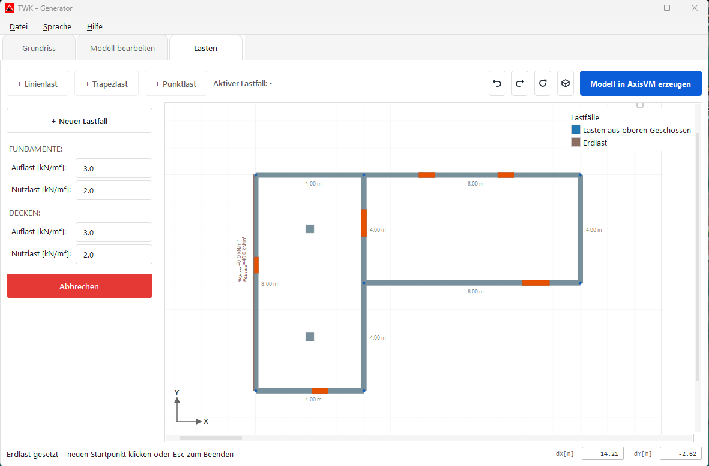

# Lasten

Im AxisVM Modellgenerator werden im Bereich **Lasten** Lastfälle erstellt und Lasten direkt auf das Modell gezeichnet.

## Neuen Lastfall anlegen

1. Auf **„+ Neuer Lastfall"** klicken.
2. Lastfallname eingeben.
3. Lastfall starten und als **aktiven Lastfall** verwenden.
4. Danach je nach Bedarf **Linienlast**, **Trapezlast** oder **Punktlast** wählen und im Modell platzieren.
5. Nach dem Zeichnen der Lasten den Lastfall mit **„Lastfall beenden"** abschließen.

## Lastarten auswählen und platzieren

Für den aktiven Lastfall können folgende Lastarten gewählt werden:

- **+ Linienlast**
- **+ Trapezlast**
- **+ Punktlast**

### Beispiel: Linienlast eingeben

1. **„+ Linienlast"** wählen und Werte im Dialog bestätigen.
2. Maus auf die gewünschte Position bewegen und bei Bedarf mit **Insert** den Koordinaten-Ursprung setzen.
3. Startpunkt entweder per Mausklick setzen oder über **dX/dY** und **Enter** exakt eingeben.
4. Endpunkt per Mausklick oder erneut über **dX/dY** und **Enter** setzen.
5. Die Linienlast wird gesetzt; danach kann direkt die nächste Linienlast platziert werden.
6. Mit **Esc** oder **Abbrechen** den Modus beenden.

> **Trapezlast und Punktlast** funktionieren analog: Trapezlast über Start-/Endpunkt (Maus oder dX/dY+Enter), Punktlast über einen Klickpunkt bzw. Koordinateneingabe.

## Erdlast erzeugen und setzen

1. **„+ Erdlast"** wählen und die Erdlast-Parameter im Dialog bestätigen.
2. Im Modell auf einer Wand den **Startpunkt** anklicken.
3. Auf derselben Wand (oder am zulässigen Anschluss) den **Endpunkt** anklicken.
4. Die Erdlast wird auf den gewählten Wandabschnitt übernommen.
5. Mit **Esc** oder **Abbrechen** den Erdlast-Modus beenden.

## Lasten für Fundamente und Decken

In der linken Seitenleiste können zusätzlich Flächenlasten eingegeben werden:

- **Fundamente:** Auflast und Nutzlast
- **Decken:** Auflast und Nutzlast

## Bedienung in Lasten

- **Abbrechen/Esc:** Aktiven Lastmodus jederzeit mit **Esc** oder dem jeweiligen **Abbrechen**-Button beenden.
- **Undo/Redo:** Änderungen mit **Ctrl+Z** und **Ctrl+Y** rückgängig machen oder wiederholen.
- **Zurücksetzen:** Ansicht mit dem Zurücksetzen-Icon neu einpassen.
- **3D-Ansicht:** Über den 3D-Button zwischen 2D- und 3D-Ansicht umschalten.
- **Koordinateneingabe:** Mit **Insert** Koordinaten-Ursprung setzen; über **dX/dY** Lasten präzise platzieren.

## AxisVM-Modell erzeugen

Im Lasten-Tab wird über **„Modell in AxisVM erzeugen"** der Export gestartet.

1. Export-Button klicken
2. Speicherort und Dateiname der `.axs`-Datei wählen
3. Export abschließen
4. Optional direkt zurück in die TWK-App wechseln

Mit dem Button **„Modell in AxisVM erzeugen"** wird das AxisVM-Modell aus dem aktuellen Generator-Modell erstellt und als `.axs`-Datei gespeichert.

Nach dem Export fragt die Generator-App, ob direkt zur TWK-App gewechselt werden soll. Bei **Ja** wird das erzeugte Modell sofort in die TWK-App übernommen.
